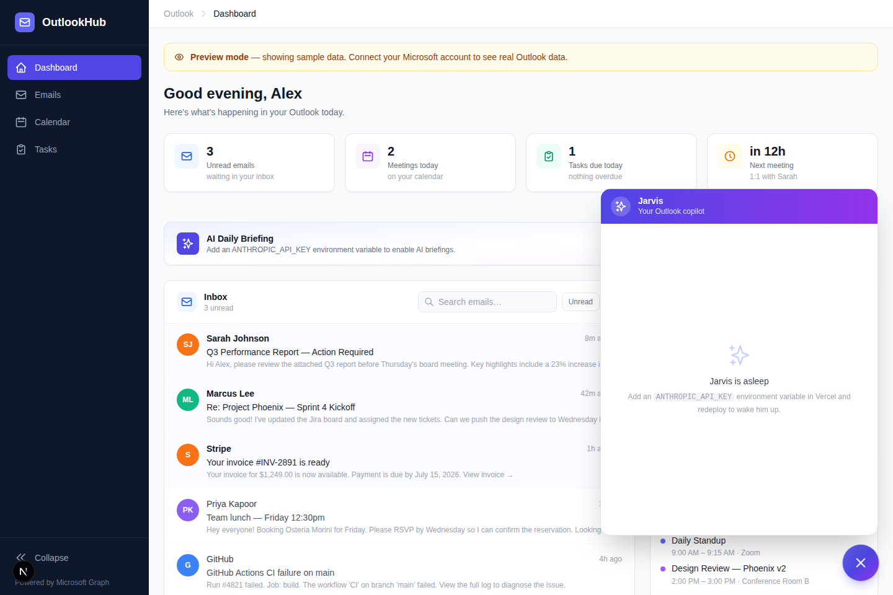

# Outlook Dashboard

A personal productivity dashboard that shows your Outlook **inbox**, **calendar events** (next 7 days), and **To-Do tasks** in one place.



Built with Next.js 16, Tailwind CSS, and Microsoft Graph.

## How it works

The app automatically picks a data source based on which environment variables are set:

| Priority | Mode | When active | Data |
|---|---|---|---|
| 1 | **Graph API** | `MICROSOFT_REFRESH_TOKEN` is set | Live, full read/write |
| 2 | **Power Automate** | `UPSTASH_REDIS_REST_URL` is set | Synced every 15 min, read-only |
| 3 | **Demo** | Nothing set | Sample data |

No login screen in any mode — the dashboard opens directly.

## Bonus: DJ Mixer (`/mixer`)

A dual-deck DJ mixer for YouTube, at **`/mixer`**. Paste any YouTube link on each deck — regular `watch` URLs, `youtu.be` short links, **Shorts/reels**, embeds, live URLs, or YouTube Music links — and mix:

- Equal-power **crossfader** + master volume + per-deck level faders
- **Tempo** control (0.25×–2×) with hold-to-nudge pitch bend and tempo **Sync** between decks
- **Tap-BPM** per deck (Sync matches effective BPM when both decks have a tapped BPM)
- Cue point, 4 **hot cues** per deck, and **loop** in/out with ½×/2× resizing
- Keyboard shortcuts (shown at the bottom of the page)

Playback uses the official YouTube IFrame Player API — nothing is downloaded or re-hosted.

## Quick start (demo mode)

```bash
npm install
npm run dev
# open http://localhost:3000
```

Works immediately with sample data, no configuration needed.

## Deploy to Vercel

1. Go to [vercel.com/new](https://vercel.com/new) and import this repository
2. Select the branch you want to deploy (or merge to `main` first)
3. Add environment variables for your chosen mode (see below), or none for demo mode
4. Deploy — your app is live at `https://<project>.vercel.app`

## Option A — Direct Microsoft Graph connection

Best option **if** you can register an Azure app (personal Microsoft accounts always can; corporate tenants may require admin consent).

1. [portal.azure.com](https://portal.azure.com) → App registrations → New registration
2. **API permissions** → add delegated Graph permissions: `Mail.Read`, `Calendars.Read`, `Tasks.ReadWrite`, `User.Read`
3. **Authentication** → Settings → **Allow public client flows** → Yes
4. Fill `CLIENT_ID` / `TENANT_ID` into `get_token.py`, then:
   ```bash
   pip install msal
   python get_token.py
   ```
5. Follow the device-code prompt, then set the printed token:
   ```
   AZURE_AD_CLIENT_ID=...
   AZURE_AD_TENANT_ID=...
   MICROSOFT_REFRESH_TOKEN=...
   ```

> ⚠️ If your organization shows **"Need admin approval"** at sign-in, either ask IT to grant consent (`https://login.microsoftonline.com/<tenant-id>/adminconsent?client_id=<client-id>`) or use Option B.

## Option B — Power Automate (no IT approval needed)

Power Automate is a Microsoft first-party product, so it isn't blocked by app-consent policies. Flows pull your Outlook data every 15 minutes and push it to this app's webhooks.

### B1. Create the database (free)

1. Sign up at [upstash.com](https://upstash.com) → Create a **Redis** database
2. From the database page, copy the **REST URL** and **REST token**

### B2. Set environment variables (Vercel → Project → Settings → Environment Variables)

```
UPSTASH_REDIS_REST_URL=https://<your-db>.upstash.io
UPSTASH_REDIS_REST_TOKEN=<your-token>
WEBHOOK_SECRET=<any random string you invent>
```

Redeploy after saving.

### B3. Create three Power Automate flows

Go to [make.powerautomate.com](https://make.powerautomate.com) → Create → **Scheduled cloud flow**, repeat once per data type:

**Flow 1 — Emails**
1. Trigger: Recurrence, every **15 minutes**
2. Add action: **Office 365 Outlook → Send an HTTP request** *(this connector uses your own mailbox permissions — no admin approval)*
   - URI: `https://graph.microsoft.com/v1.0/me/mailFolders/inbox/messages?$top=25&$select=id,subject,from,receivedDateTime,isRead,bodyPreview&$orderby=receivedDateTime desc`
   - Method: `GET`
3. Add action: **HTTP** (or "HTTP with Microsoft Entra ID (preauthorized)" if plain HTTP is premium-locked)
   - Method: `POST`
   - URI: `https://<your-app>.vercel.app/api/webhooks/emails`
   - Headers: `x-webhook-secret: <your WEBHOOK_SECRET>` and `Content-Type: application/json`
   - Body: the **Body** output of step 2

**Flow 2 — Calendar** — same pattern, with:
- Graph URI: `https://graph.microsoft.com/v1.0/me/calendarView?startDateTime=@{utcNow()}&endDateTime=@{addDays(utcNow(),7)}&$top=15&$select=id,subject,start,end,location,isAllDay&$orderby=start/dateTime`
- Webhook: `https://<your-app>.vercel.app/api/webhooks/calendar`

**Flow 3 — Tasks** — same pattern, with:
- Graph URI: `https://graph.microsoft.com/v1.0/me/todo/lists` → then a second request to `/me/todo/lists/<list-id>/tasks?$top=20&$filter=status ne 'completed'`
- Webhook: `https://<your-app>.vercel.app/api/webhooks/tasks`

Run each flow manually once (**Test** button) — your real data appears on the dashboard immediately after.

### Webhook API

| Endpoint | Method | Body | Auth |
|---|---|---|---|
| `/api/webhooks/emails` | POST | Graph messages response | `x-webhook-secret` header |
| `/api/webhooks/calendar` | POST | Graph calendarView response | `x-webhook-secret` header |
| `/api/webhooks/tasks` | POST | Graph todo tasks response | `x-webhook-secret` header |

## Project structure

```
app/
  page.tsx                    → redirects to /dashboard
  dashboard/                  → main dashboard (layout + page)
  api/outlook/                → read endpoints used by the UI
  api/webhooks/               → Power Automate push endpoints
components/                   → EmailsList, CalendarWidget, TasksList, Sidebar, Header
lib/
  graph.ts                    → data-source router (Graph / Redis / demo)
  token.ts                    → refresh-token → access-token exchange
  redis.ts                    → Upstash client
  mock-data.ts                → demo data
get_token.py                  → one-time device-flow script (Option A)
```
